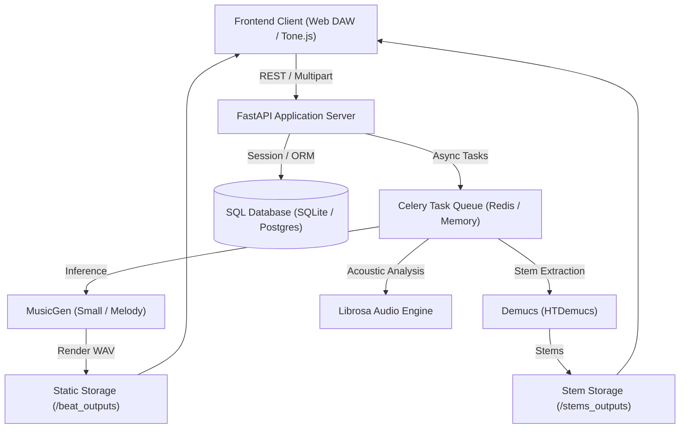

# BeatFlow AI (Melodyfy) 🎵⚡

> **AI-Powered Generative Music Production Suite with "Git for Audio" Version Control & Web DAW**

[](https://fastapi.tiangolo.com)
[](https://pytorch.org)
[](https://github.com/facebookresearch/audiocraft)
[](https://github.com/facebookresearch/demucs)
[](https://tonejs.github.io/)

---

## 🌟 Executive Summary

**BeatFlow AI** bridges generative AI and music engineering. It combines state-of-the-art text/melody conditioning models (Meta MusicGen) with a full multi-track in-browser DAW and a novel **"Git for Audio" version-control engine**. Creators can synthesize tracks, extract stems (drums, bass, vocals, melody), compare harmonic diffs, branch, and collaborate seamlessly.

---

## 🚀 Key Features

- 🎹 **Text-to-Beat & Vibe Conditioning** — Generate production-ready instrumentals across 25+ curated genres with customized BPM and mood prompts.
- 🎤 **Hum-to-Beat (Melody Conditioning)** — Record or upload a vocal melody/humming to condition MusicGen-Melody for structured song synthesis.
- 🎛️ **4-Stem Audio Separation (Demucs HTDemucs)** — Deep learning stem extraction isolating Drums, Bass, Vocals, and Synths into individual WAV tracks.
- 🌿 **"Git for Audio" Genealogy Tree** — Full version control for music projects:
  - Commit audio snapshots with metadata (BPM, key signature, LUFS loudness).
  - Branch, fork, and merge community remix trees.
  - Acoustic and harmonic diff comparison between revisions.
- 🎚️ **In-Browser Web DAW Mixer** — Per-channel volume faders, stereo panning, reverb impulse response, 8D spatial audio, mute/solo, and audio-reactive 60fps canvas visualizers.
- 🪄 **AI Mastering & Audio Intelligence** — Automatic EBU R128 loudness normalization (-14 LUFS standard) and true-peak brickwall limiting.
- 🎼 **Audio-to-MIDI Transcription** — Extract note onsets and melodic pitches directly into downloadable `.mid` format.

---

## 🏗️ Architecture & Data Flow



---

## 📂 Project Structure

```
melodify_Tune_AI/
├── frontend/               # Web DAW UI, Studio, Pages & Canvas Visualizers
│   ├── index.html          # Landing page & hero audio demo
│   ├── studio.html         # Multi-track Web DAW, Beat Generator & Stem Editor
│   ├── dashboard.html      # Creator dashboard & quick project generator
│   ├── explore.html        # Community discovery & remix feeds
│   ├── projects.html       # Public project listings & search
│   ├── repo.html           # Repository view & commit timeline
│   ├── project_tree.html   # Visual Git audio commit graph
│   ├── library.html        # User asset library & saved beats
│   ├── settings.html       # Audio configuration & profile settings
│   ├── community.html      # Creator profiles & social feed
│   ├── nav.js              # Shared navigation component
│   └── visualizer.js       # Real-time 60fps Canvas 2D audio visualizer
│
├── backend/                # FastAPI Application Server, Database & Audio Engines
│   ├── api_server.py       # Core FastAPI REST & SSE Streaming Server
│   ├── audio_processing.py # Multi-genre synthesis, Demucs splitting & AI mastering
│   ├── database.py         # SQLAlchemy SQLite/PostgreSQL database engine
│   ├── models.py           # Database schemas (Users, Repositories, Commits, Stems)
│   ├── auth.py             # Argon2 password hashing & JWT token handling
│   ├── celery_worker.py    # Asynchronous job queue for background audio compute
│   └── run_demucs.py       # Demucs runtime wrapper
│
├── ml/                     # Machine Learning & AI Generation Scripts
│   ├── beat_generator.py   # Standalone MusicGen inference engine
│   └── setup_musicgen.bat  # Automated model cache downloader
│
├── docs/                   # Architectural blueprints & documentation
├── tests/                  # Verification scripts & audio tests
├── run.py                  # Single-command launcher (python run.py)
├── start_server.ps1        # PowerShell server watchdog launcher
├── install_deps.ps1        # Dependency installer
├── requirements.txt        # Python dependency manifest
└── README.md               # Project documentation
```

---

## ⚡ Quickstart Guide

### 1. Run the Platform

```bash
# Launch the API server and Web DAW
python run.py
```

Open your browser to **[http://localhost:8000/ui/studio.html](http://localhost:8000/ui/studio.html)** to start creating!

```bash
pip install -r requirements.txt
```

### 3. Launch BeatFlow API & Web DAW

```bash
python api_server.py
```

Open your browser and navigate to:
👉 **`http://localhost:8000`**

---

## 📡 REST API Reference

| Method | Endpoint | Description | Auth |
|---|---|---|---|
| `GET` | `/health` | Service health & GPU status | Public |
| `POST` | `/generate` | Generate beat from prompt (synchronous) | Optional |
| `POST` | `/generate/async` | Dispatch Celery generation job | Optional |
| `POST` | `/hum` | Hum-to-beat audio conditioning | Optional |
| `POST` | `/separate` | 4-stem Demucs separation | Optional |
| `POST` | `/analyze` | Extract BPM, key, energy, loudness | Public |
| `POST` | `/master` | -14 LUFS AI Mastering | Public |
| `POST` | `/audio-to-midi` | Melodic Audio to `.mid` transcription | Public |
| `POST` | `/auth/register` | Create user account | Public |
| `POST` | `/auth/login` | Obtain JWT access token | Public |
| `GET` | `/projects` | List public audio repositories | Public |
| `POST` | `/projects` | Create new audio repository | JWT |
| `POST` | `/projects/{id}/commit` | Commit mix snapshot to project tree | JWT |
| `POST` | `/projects/{id}/fork` | Fork audio tree into new project | JWT |

---

## 🛠️ Tech Stack

- **Backend**: FastAPI, Uvicorn, SQLAlchemy, Pydantic, Python-JOSE, Argon2
- **Audio & ML**: Meta MusicGen, HTDemucs, PyTorch, Librosa, PyLoudNorm, SoundFile
- **Async Queue**: Celery, Redis (with automatic in-memory fakeredis fallback)
- **Frontend**: Vanilla HTML5, CSS3 Glassmorphism, Web Audio API, Canvas 2D, Tone.js

---

## 📄 License

Distributed under the MIT License. See `LICENSE` for more information.
