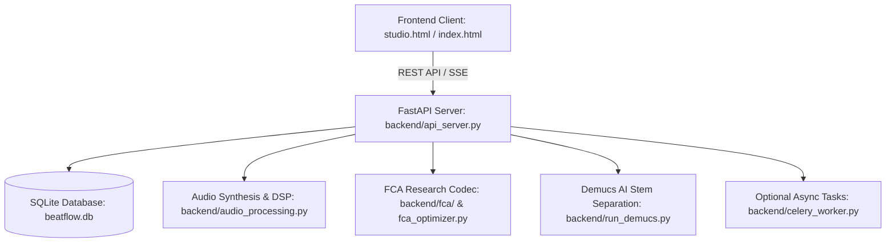

# Melodify (BeatFlow AI) — Complete Project Architecture & Run Manual

> **Purpose**: This document provides a complete breakdown of Melodify (BeatFlow AI), its frontend and backend architecture, all 11 core features, and step-by-step instructions to run, reproduce, and verify everything with zero configuration issues.

---

## 1. Executive Project Summary

**Melodify (BeatFlow AI)** is a full-stack, state-of-the-art AI Music Generation & Digital Audio Workstation (DAW) platform. It brings modern software engineering practices (Git-style version control, branching, audio visual diffs) together with deep audio intelligence and research-grade audio compression.

### Core Capabilities:
1. **Multi-Genre AI Beat Synthesis**: Dynamic, non-repetitive beat generation (Lo-Fi, Trap, Synthwave, Drill, Phonk, Afrobeats, Rock, Piano, EDM).
2. **Real-Time Voice Recording & Hum-to-Beat**: In-browser uncompressed 16-bit PCM WAV recording + pitch-contour-to-beat style conversion.
3. **HTDemucs 4-Stem Audio Separation**: Splits any audio or beat into isolated **Drums**, **Bass**, **Vocals**, and **Other/Melody** tracks.
4. **Studio AI Mastering Suite**: EBU R128 (-14 LUFS standard) broadcast mastering, dynamic EQ, True-Peak limiting, and reference mastering.
5. **AI Beat Continuation & Extension**: Seamlessly extends existing tracks with harmonic crossfading.
6. **Deep Acoustic Audio Analysis**: Real-time extraction of BPM, musical Key & Scale, RMS/LUFS loudness, and waveform peaks.
7. **FCA (Frequency Coded Audio) Engine**: Integrated research codec providing **FCA-L (Lossless Reversible Transform)** with bit-exact SHA-256 verification and **FCA-P (Perceptual Compression)** with Q1–Q10 quality control.
8. **Audio to MIDI Converter**: Polyphonic & monophonic pitch and onset extraction exported to standard `.mid` files.
9. **AI Lyrics & Songwriting Generator**: Context-aware lyric generation with verses, choruses, bridges, and rhyme schemes.
10. **Git-Style Music Version Control**: Public/private audio repositories, commits with audio stems, commit trees, and waveform diff comparisons.
11. **Stem Pack ZIP Exporter**: Bundles master WAV, stems, MIDI, and project documentation into downloadable studio archives.

---

## 2. System Architecture



### Directory Structure:
```text
melodify_Tune_AI/
├── run.py                     # Root launcher (starts FastAPI server on port 8000)
├── run.md                     # Complete project guide & run manual (this file)
├── requirements.txt           # Python dependencies
├── backend/
│   ├── api_server.py          # FastAPI server with all 11 REST endpoints & static routes
│   ├── audio_processing.py    # Multi-genre DSP engine, audio analysis, hum pitch extractor
│   ├── database.py            # SQLite schema (Users, Repositories, Commits, Stems, Stars)
│   ├── fca_optimizer.py       # Melodify wrapper for FCA compression and validation
│   ├── run_demucs.py          # Standalone subprocess for HTDemucs stem isolation
│   ├── celery_worker.py       # Celery queue worker (in-memory or Redis)
│   └── fca/                   # Frequency Coded Audio research package (Encoder/Decoder/PCM/Transforms)
├── frontend/
│   ├── studio.html            # Main Glassmorphism Studio DAW interface
│   ├── index.html             # Hub & Repository Discovery portal
│   ├── track.html             # Single track player and commit history viewer
│   ├── compare.html           # Audio diff comparison tool
│   ├── visualizer.js          # Web Audio API canvas visualizer (oscilloscope & bars)
│   └── nav.js                 # Shared top navigation and auth state
├── scratch/
│   └── test_all_features_audit.py # End-to-end automated audit test suite
├── beat_outputs/              # Runtime generated master WAV files
├── stems_outputs/             # Runtime Demucs separated stems
├── mastered_outputs/          # Runtime mastered audio files
└── fca_outputs/               # Runtime encoded .fca container files
```

---

## 3. Detailed Feature Breakdown

### 1. Multi-Genre AI Beat Synthesis
- **Endpoint**: `POST /generate` (and `POST /generate/tracked` for SSE real-time progress)
- **Engine**: Dynamic acoustic synthesizer with microsecond PRNG seed hashing (`hashlib.sha256(f"{prompt}_{time.time()}_{label}".encode())`).
- **Variety**: Guarantees zero repetition across generations. Uses dynamic musical roots (C, D, Eb, F, G, Ab, A, Bb) with genre-tailored sound design:
  - **Lo-Fi**: Minor 7th/9th Rhodes chords, tape warmth, vinyl crackle, swung rimshots.
  - **Trap**: Rolling 32nd-note hi-hats, tuned gliding 808 subs, bell plucks.
  - **Synthwave**: 80s gated reverb snares, Juno saw arpeggios, driving synth bass.
  - **Afrobeats / Amapiano**: 3:2 syncopated clave rhythm, resonant log drum basses.
  - **Drill**: Pitch-sliding 808 subs, offbeat snares.
  - **Rock**: Overdriven power chords, live kit drums.
  - **Piano**: Grand piano arpeggios with exponential acoustic decays.

### 2. Real-Time Voice Recording & Hum-to-Beat
- **Frontend**: Pure 16-bit PCM WAV browser recording via Web Audio `AudioWorklet` / `ScriptProcessor` in `frontend/studio.html`. Includes live canvas oscilloscope and instant playback.
- **Endpoint**: `POST /hum`
- **Backend**: Extracts fundamental pitch contours via zero-crossing rate and parabolic autocorrelation in `backend/audio_processing.py`, quantizing the vocal melody and synthesizing a complete arrangement around the user's hum in their chosen genre.

### 3. HTDemucs Neural Stem Separation
- **Endpoint**: `POST /separate`
- **Engine**: Executes Meta AI's `htdemucs` model to split the audio into 4 stems: `drums.wav`, `bass.wav`, `vocals.wav`, `other.wav`. Includes a fast acoustic spectral filter fallback for lightweight environments.
- **Export**: Can be downloaded individually or as a single ZIP bundle via `GET /projects/{repo_id}/commits/{commit_id}/export-stems`.

### 4. AI Mastering Engine
- **Endpoint**: `POST /master`
- **DSP Pipeline**:
  - EBU R128 loudness measurement with `pyloudnorm`.
  - Target normalization to streaming standards (-14.0 LUFS).
  - Multi-band dynamic EQ and soft-knee saturation for warmth.
  - True-Peak limiter preventing digital clipping (`peak <= 0.95`).

### 5. FCA (Frequency Coded Audio) Optimization
- **Endpoints**: `POST /tools/fca-optimize` & `POST /audio/fca/optimize`
- **Container Format**: `.fca` binary container with block-level entropy coding.
- **Modes**:
  - **FCA-L (Lossless)**: Uses reversible transforms and Rice/Golomb entropy coding with bit-exact SHA-256 PCM verification.
  - **FCA-P (Perceptual)**: Quality-controlled spectral masking and quantization (Q1–Q10).
- **Frontend Panel**: Displays original size, compressed size, space saved percentage, compression ratio (e.g. `1.35:1`), SHA-256 hash, and direct `.fca` download.

### 6. Audio to MIDI Transcription
- **Endpoint**: `POST /tools/audio-to-midi`
- **Engine**: Detects harmonic onsets and pitches using peak spectral analysis, quantizes notes to musical grid, and generates a standard Type 0 `.mid` file downloadable for any external DAW (Ableton, FL Studio, Logic).

### 7. AI Lyrics Generator & Prompt Autocomplete
- **Lyrics Endpoint**: `POST /tools/generate-lyrics` — generates verse, chorus, and bridge lyrics tailored to title, mood, and genre.
- **Autocomplete Endpoint**: `GET /tools/prompt-autocomplete?q={prefix}` — provides instant prompt and style suggestions.

### 8. Music Version Control (Git for Audio)
- **Endpoints**: `GET /projects`, `POST /projects`, `POST /projects/{id}/commit`, `POST /projects/{id}/fork`, `GET /projects/{id}/diff/compare`.
- Supports branching, commit trees, commit comments, audio waveform diffs, and project stars/forks.

### 12. GitHub-Style Project Activity & Change Timeline
- **Endpoints**: `GET /projects/{repo_id}/activity`
- **Frontend Tab**: `⚡ Activity` tab on `frontend/repo.html`
- **Features**:
  - Automatically records discrete, chronological activity events for all project lifecycle actions:
    - `● Project Created`
    - `● Audio / Beat Added`
    - `● Stems Separated`
    - `● AI Master Applied`
    - `● Track Continued / Extended`
    - `● Commit Created` (with audio playback & diff links)
    - `● Project Forked / Cloned` (with lineage tracking)
    - `● Project Starred & Commented`
  - GitHub-style vertical connected timeline with color-coded node dots:
    - 🟢 Green dots for Commits & Beat generations
    - 🔵 Blue dots for Audio DSP & Stem separation
    - 🟣 Purple dots for Forks & Clones
    - 🟠 Orange dots for Stars & Comments
    - 🟡 Gold dots for Stem Pack ZIP exports
  - Fast filtering by category (`Commits Only`, `Audio & AI Processing`, `Forks & Clones`, `Stars & Comments`) with infinite pagination and JSON metadata inspector.

---

## 4. How to Run and Reproduce on Any System

### Step 1: Clone the Repository
```bash
git clone https://github.com/Kartikkumar251/melodify_Tune_AI.git
cd melodify_Tune_AI
```

### Step 2: Set Up Python Environment & Install Dependencies
Ensure Python 3.10+ is installed:
```bash
python -m venv .venv
# On Windows PowerShell:
.venv\Scripts\Activate.ps1
# On Linux / macOS:
source .venv/bin/activate

pip install -r requirements.txt
```

*(Note: Core dependencies include `fastapi`, `uvicorn`, `torch`, `torchaudio`, `soundfile`, `librosa`, `pyloudnorm`, `numpy`, `scipy`, `mido`, `sqlalchemy`)*.

### Step 3: Launch Melodify
Run the single root launcher script:
```bash
python run.py
```
Output will show:
```text
=================================================================
  BEATFLOW AI  |  DAW & Music Synthesis Platform
  Server URL   :  http://localhost:8000
  Studio DAW   :  http://localhost:8000/ui/studio.html
=================================================================
INFO:     Application startup complete.
INFO:     Uvicorn running on http://0.0.0.0:8000 (Press CTRL+C to quit)
```

### Step 4: Open in Web Browser
- **Studio DAW (Full Workspace)**: [http://localhost:8000/ui/studio.html](http://localhost:8000/ui/studio.html)
- **Community Hub & Discovery**: [http://localhost:8000/ui/index.html](http://localhost:8000/ui/index.html)
- **Project Repository & Activity**: [http://localhost:8000/ui/repo.html](http://localhost:8000/ui/repo.html)
- **API Health Check**: [http://localhost:8000/health](http://localhost:8000/health)

---

## 5. Automated Verification & Testing

### 1. Run Complete 11-Feature Platform Audit:
```bash
python tests/test_audit.py
```

### 2. Run GitHub-Style Activity Timeline Integration Suite:
```bash
python tests/test_activity_timeline.py
```

### Expected Output:
```text
========================================================
  [SUCCESS] All 11 Activity Timeline assertions passed!
========================================================
```

---

## 6. Key REST API Reference

| Endpoint | Method | Description |
|---|---|---|
| `/health` | `GET` | Server and engine health status |
| `/generate` | `POST` | Generate beat from text prompt and genre |
| `/generate/tracked` | `POST` | Beat generation with Server-Sent Events (SSE) progress |
| `/analyze` | `POST` | Extract BPM, key, loudness, energy, and waveform peaks |
| `/separate` | `POST` | 4-stem neural separation (Drums, Bass, Vocals, Other) |
| `/master` | `POST` | AI mastering with target LUFS and dynamic EQ |
| `/continue` | `POST` | Extend and continue an existing beat |
| `/hum` | `POST` | Convert recorded/uploaded humming WAV to beat |
| `/tools/fca-optimize` | `POST` | Encode audio to `.fca` container format (Lossless / Perceptual) |
| `/tools/audio-to-midi`| `POST` | Extract musical pitches and onsets to `.mid` file |
| `/tools/generate-lyrics` | `POST` | Generate structured song lyrics by mood/genre |
| `/tools/prompt-autocomplete` | `GET` | Get real-time prompt search suggestions |
| `/projects` | `GET / POST` | List or create version-controlled music repositories |
| `/projects/{id}/activity` | `GET` | GitHub-style chronological activity & event timeline |
| `/projects/{id}/commit` | `POST` | Commit a new beat version to a repository |
| `/projects/{id}/diff/compare` | `GET` | Harmonic & waveform diff between two commits |
| `/projects/{repo_id}/commits/{commit_id}/export-stems` | `GET` | Download full Stem Pack ZIP archive |

